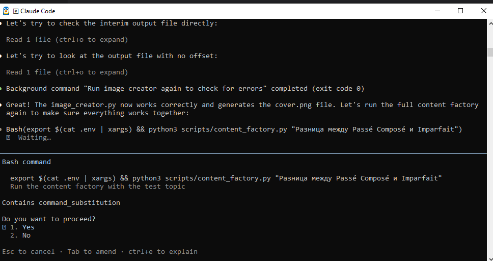
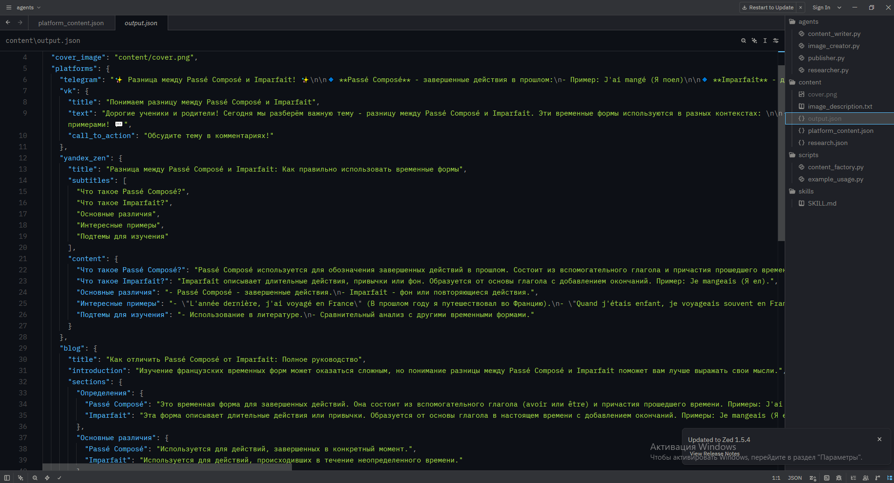
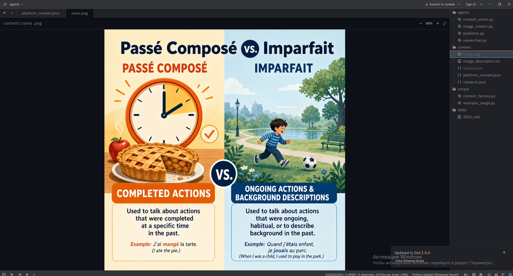
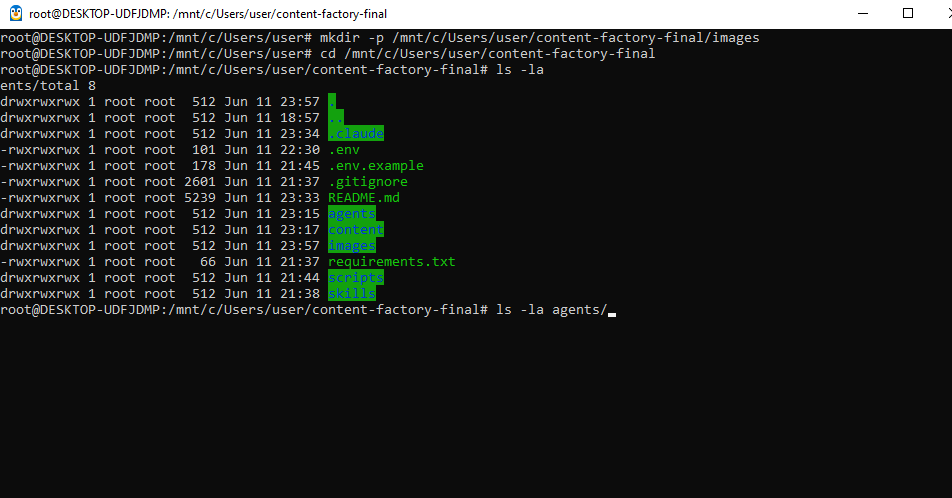
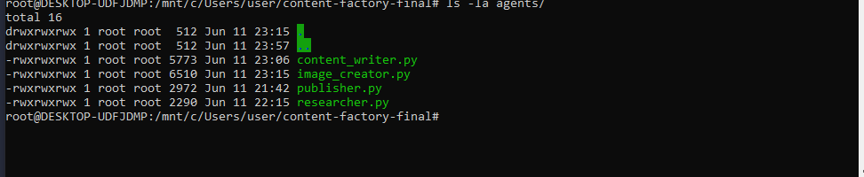
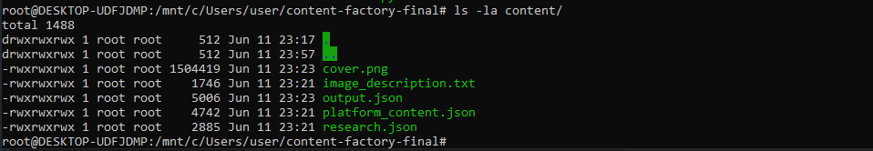

# Content Factory — Контент-завод для маркетологов EdTech

## Формула кейса

Я сделала проект Content Factory для вайб-маркетологов в EdTech, который помогает решить проблему выгорания при создании контента. Пользователь задаёт тему урока, на выходе получает готовый пост для 5 платформ (Telegram, VK, Дзен, Блог, TikTok) с обложкой за 3-5 минут. Это полезно потому, что экономит 2-3 часа ручной работы.

## Для кого

- Вайб-маркетологи, продвигающие онлайн-школы
- Репетиторы иностранных языков (английский, французский, испанский)
- Онлайн-школы с несколькими языковыми направлениями

## Описание проекта

**Проблема:** Вайб-маркетологи в онлайн-школах и репетиторы иностранных языков тратят 2-3 часа на создание одного поста для каждой площадки. Это приводит к выгоранию и нерегулярным публикациям.

**Решение:** Система, которая преобразует тему урока в готовый контент для 5 платформ (Telegram, VK, Дзен, Блог, TikTok) с уникальной обложкой всего за 3-5 минут.

## Основные функции

- Генерация контента для 5 популярных платформ
- Создание уникальной обложки для публикаций
- Сохранение результатов в формате JSON и PNG

## MVP и будущее развитие

### Что есть сейчас (MVP)
- Генерация контента для 5 платформ
- Создание обложки
- Экспорт в JSON-формат

### Что планируется добавить
- Автопубликация в Telegram/VK
- Веб-интерфейс
- База данных
- Шаблоны для разных ниш

## Скриншоты работы

### Скриншот запуска скрипта


### Скриншот output.json


### Скриншот обложки cover.png


## Roadmap развития

- Q1 2026: Автопубликация в Telegram и VK
- Q2 2026: Веб-интерфейс для не-технических пользователей
- Q3 2026: Интеграция с Notion и Trello
- Q4 2026: Мультиязычность (поддержка английского, испанского, немецкого)

## Структура проекта

- `agents/` — Субагенты для различных задач
- `skills/` — Навыки системы
- `scripts/` — Python скрипты
- `content/` — Результаты генерации

## Технологии

- Claude Code
- Python 3.12+
- OpenAI API через ProxyAPI
- JSON, Markdown

## Установка

1. Клонируйте репозиторий:
   ```
   git clone <repository-url>
   cd content-factory-final
   ```

2. Создайте виртуальное окружение и активируйте его:
   ```
   python -m venv venv
   source venv/bin/activate  # На Windows: venv\Scripts\activate
   ```

3. Установите зависимости:
   ```
   pip install -r requirements.txt
   ```

4. Скопируйте файл конфигурации и добавьте свои API ключи:
   ```
   cp .env.example .env
   ```

## Использование

1. Запустите генерацию контента:
   ```
   python scripts/content_factory.py "Тема вашего урока"
   ```

2. Посмотрите пример:
   ```
   python scripts/example_usage.py
   ```

## Агенты

1. **Researcher** (`agents/researcher.py`) - Исследует тему урока
2. **Content Writer** (`agents/content_writer.py`) - Создает контент для разных платформ
3. **Image Creator** (`agents/image_creator.py`) - Генерирует обложку
4. **Publisher** (`agents/publisher.py`) - Компилирует финальный результат

## Результаты

После выполнения скрипта будут созданы следующие файлы в директории `content/`:
- `output.json` - Контент для всех платформ
- `cover.png` - Обложка для постов
- `research.json` - Результаты исследования темы
- `platform_content.json` - Контент для каждой платформы
- `image_description.txt` - Описание обложки

## Лицензия

MIT


## 📸 Скриншоты работы

### Структура проекта


### Агенты проекта


### Запуск скрипта


### Результат output.json


### Обложка cover.png


### Контент для платформ


## 🐳 Запуск в Docker

Проект можно запустить в Docker-контейнере одной командой — без установки Python и зависимостей.

### Предварительные требования

- Установленный [Docker Desktop](https://www.docker.com/products/docker-desktop/)
- API-ключ от [ProxyAPI](https://console.proxyapi.ru/)

### Быстрый запуск


docker run --rm \
           -e OPENAI_API_KEY=ваш_ключ \
           -e OPENAI_BASE_URL=https://api.proxyapi.ru/openai/v1 \
           -v $(pwd)/content:/app/content \
           larik7lolik/content-factory \
           python scripts/content_factory.py "Тема урока"
           
## Что делает каждая часть команды:
Флаг
Описание
--rm
Автоматически удаляет контейнер после завершения
-e OPENAI_API_KEY=...
Передаёт API-ключ внутрь контейнера
-e OPENAI_BASE_URL=...
Указывает URL ProxyAPI
-v $(pwd)/content:/app/content
Связывает папку content/ на вашем компьютере с папкой внутри контейнера
larik7lolik/content-factory
Имя образа
python scripts/...
Команда для запуска с нужной темой

## Пример сгенерированной обложки


## Сборка образа из исходников

Если хотите собрать образ самостоятельно:
# Клонируйте репозиторий
git clone https://github.com/larik7lolik/content-factory-final.git
cd content-factory-final

# Соберите образ
docker build -t content-factory .

# Запустите
docker run --rm \
           -e OPENAI_API_KEY=ваш_ключ \
           -e OPENAI_BASE_URL=https://api.proxyapi.ru/openai/v1 \
           -v $(pwd)/content:/app/content \
           content-factory \
           python scripts/content_factory.py "Тема урока"
           
## Что даёт Docker для этого проекта

- Портативность — работает одинаково на Windows, macOS и Linux
- Изоляция — не засоряет систему Python-зависимостями
- Простота — одна команда вместо настройки окружения
- Масштабируемость — легко запустить несколько копий
